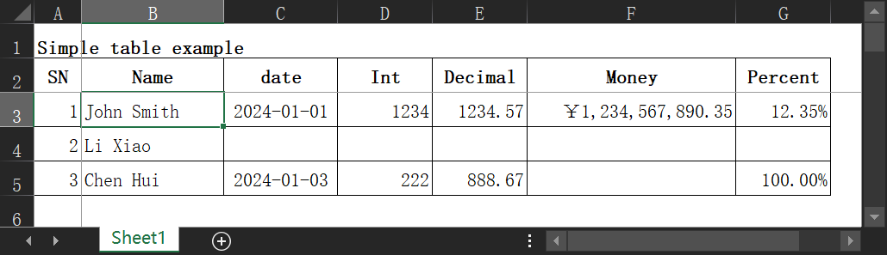
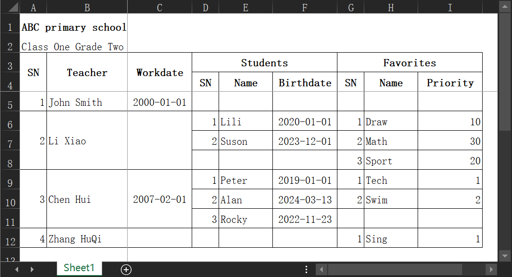

# nextrj_xlsx

JS xlsx tools base on [ExcelJS].

## Examples

Click [here](./assets/sample.xlsx) to download excel sample file.

### Generate a simple table



```ts
import { genSingleSheetWorkbook } from 'https://deno.land/x/nextrj_xlsx/mod.ts'
import type { HeadColumn } from 'https://deno.land/x/nextrj_xlsx/mod.ts'

// define head-column
const headColumns: HeadColumn[] = [
  { key: 'name', label: 'Name', width: 15, value: (_v, r) => `${r.firstName} ${r.lastName}` },
  { key: 'date', width: 12, dataCellStyle: { numFmt: 'yyyy-MM-dd', alignment: { horizontal: 'center' } } },
  { key: 'int', label: 'Int', dataCellStyle: { numFmt: '#', alignment: { horizontal: 'right' } } },
  { key: 'decimal', label: 'Decimal', dataCellStyle: { numFmt: '#0.00', alignment: { horizontal: 'right' } } },
  {
    key: 'money',
    label: 'Money',
    width: 22,
    dataCellStyle: { numFmt: '￥#,###,###,##0.00', alignment: { horizontal: 'right' } },
  },
  { key: 'percent', label: 'Percent', dataCellStyle: { numFmt: '0.00%', alignment: { horizontal: 'right' } } },
]

// define data-row
const dataRows = [
  {
    firstName: 'John',
    lastName: 'Smith',
    date: '2024-01-01',
    int: 1234,
    decimal: 1234.567,
    money: 1234567890.345,
    percent: 0.12345,
  },
  {
    firstName: 'Li',
    lastName: 'Xiao',
  },
  {
    firstName: 'Chen',
    lastName: 'Hui',
    date: '2024-01-03',
    int: 222.333,
    decimal: 888.666,
    percent: 1,
  },
]

// generate a Workbook
const workbook = await genSingleSheetWorkbook({
  headColumns,
  dataRows,
  sheetName: 'Sheet1',
  // table title
  caption: { value: 'Simple table example', style: { font: { bold: true } } },
  // share style for all head-cell and data-cell
  cellStyle: {
    alignment: { vertical: 'middle' },
    border: { top: { style: 'thin' }, left: { style: 'thin' }, bottom: { style: 'thin' }, right: { style: 'thin' } },
  },
  // specific style for all head-cell
  headCellStyle: {
    alignment: { horizontal: 'center' },
    font: { bold: true },
  },
  // specific style for all data-cell
  dataCellStyle: { alignment: { horizontal: 'left' } },
  // workbook properties
  bookProperties: {
    creator: 'NextRJ',
    created: new Date(),
    lastModifiedBy: 'NextRJ',
    modified: new Date(),
  },
  // sheet properties
  sheetProperties: {
    defaultRowHeight: 20, // default 15
    defaultColWidth: 10,
  },
  sheetView: {
    showGridLines: false,
    state: 'frozen',
    xSplit: 1,
    ySplit: 2,
    activeCell: 'B3',
  },
  sheetPageSetup: {
    paperSize: 9, // 8-A3、9-A4
    orientation: 'landscape',
    // units is inches, 0.2"*2.54=0.5cm
    margins: { top: 0.2, left: 0.2, bottom: 0.2, right: 0.2, header: 0.2, footer: 0.2 },
    fitToPage: true,
    fitToWidth: 1,
    fitToHeight: 0,
    printArea: 'A:F',
    printTitlesRow: '2:2',
  },
})

// write to file
await workbook.xlsx.writeFile('sample.xlsx')

// or send through standard Response
const response = new Response(await workbook.xlsx.writeBuffer(), {
  status: 200,
  headers: {
    'content-type': 'application/vnd.ms-excel',
    'Content-Disposition': 'attachment; filename="sample.xlsx"; filename*=UTF-8\'\'sample.xlsx',
    'Access-Control-Expose-Headers': 'Content-Disposition',
    'Access-Control-Allow-Origin': '*',
  },
})
```

### Generate a table with nested group



```ts
import { genSingleSheetWorkbook } from 'https://deno.land/x/nextrj_xlsx/mod.ts'
import type { HeadColumn } from 'https://deno.land/x/nextrj_xlsx/mod.ts'

// define head-column
const headColumns: HeadColumn[] = [
  { key: 'teacher', label: 'Teacher', width: 15, value: (_v, r) => `${r.firstName} ${r.lastName}` },
  {
    key: 'workdate',
    label: 'Workdate',
    width: 12,
    dataCellStyle: { numFmt: 'yyyy-MM-dd', alignment: { horizontal: 'center' } },
  },
  {
    label: 'Students',
    children: [
      { keys: ['students', 'name'], label: 'Name' },
      {
        keys: ['students', 'birthdate'],
        label: 'Birthdate',
        width: 12,
        dataCellStyle: { numFmt: 'yyyy-MM-dd', alignment: { horizontal: 'center' } },
      },
    ],
  },
  {
    label: 'Favorites',
    children: [
      { keys: ['favorites', 'name'], label: 'Name' },
      {
        keys: ['favorites', 'priority'],
        label: 'Priority',
        width: 12,
        dataCellStyle: { numFmt: '#', alignment: { horizontal: 'right' } },
      },
    ],
  },
]

// define data-row
const dataRows = [
  { firstName: 'John', lastName: 'Smith', workdate: '2000-01-01' },
  {
    firstName: 'Li',
    lastName: 'Xiao',
    students: [
      { name: 'Lili', birthdate: '2020-01-01' },
      { name: 'Suson', birthdate: '2023-12-01' },
    ],
    favorites: [
      { priority: 1, name: 'Draw' },
      { priority: 2, name: 'Math' },
      { priority: 3, name: 'Sport' },
    ],
  },
  {
    firstName: 'Chen',
    lastName: 'Hui',
    workdate: '2007-02-01',
    students: [
      { name: 'Peter', birthdate: '2019-01-01' },
      { name: 'Alan', birthdate: '2024-03-13' },
      { name: 'Rocky', birthdate: '2022-11-23' },
    ],
    favorites: [
      { priority: 1, name: 'Tech' },
      { priority: 2, name: 'Swim' },
    ],
  },
  { firstName: 'Zhang', lastName: 'HuQi', favorites: [{ priority: 1, name: 'Sing' }] },
]

// generate a Workbook
const workbook = await genSingleSheetWorkbook({
  headColumns,
  dataRows,
  sheetName: 'Sheet1',
  caption: { value: 'ABC primary school', style: { font: { bold: true } } },
  subCaption: 'Class One Grade Two',
  cellStyle: {
    alignment: { vertical: 'middle' },
    border: { top: { style: 'thin' }, left: { style: 'thin' }, bottom: { style: 'thin' }, right: { style: 'thin' } },
  },
  headCellStyle: { alignment: { horizontal: 'center' }, font: { bold: true } },
  dataCellStyle: { alignment: { horizontal: 'left' } },
  sheetProperties: {
    defaultRowHeight: 20, // default 15
    defaultColWidth: 10,
  },
  sheetView: {
    showGridLines: false,
    state: 'frozen',
    xSplit: 1,
    ySplit: 4,
    activeCell: 'B5',
  },
})

// write to file
await workbook.xlsx.writeFile('sample.xlsx')
```

[ExcelJS]: https://github.com/exceljs/exceljs
[intl-dateformat]: https://github.com/zapier/intl-dateformat
[Intl.DateTimeFormat cheatsheet]: https://devhints.io/wip/intl-datetime
